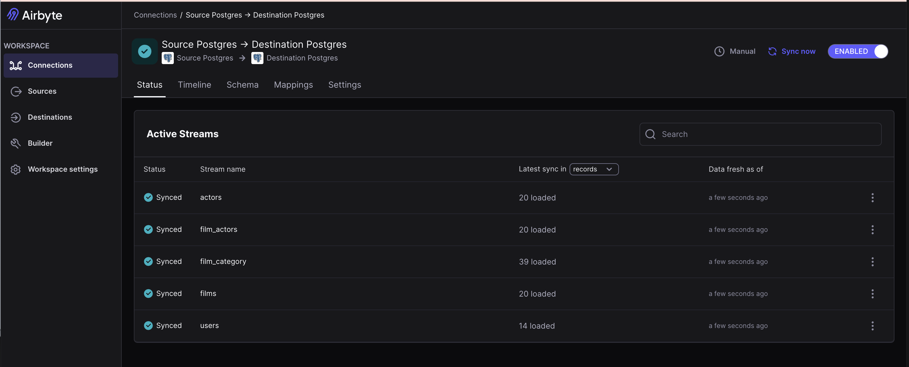
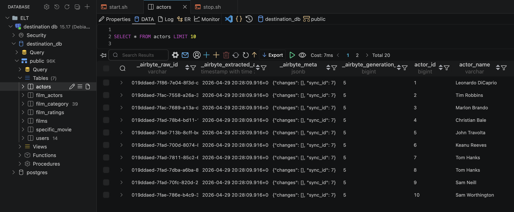
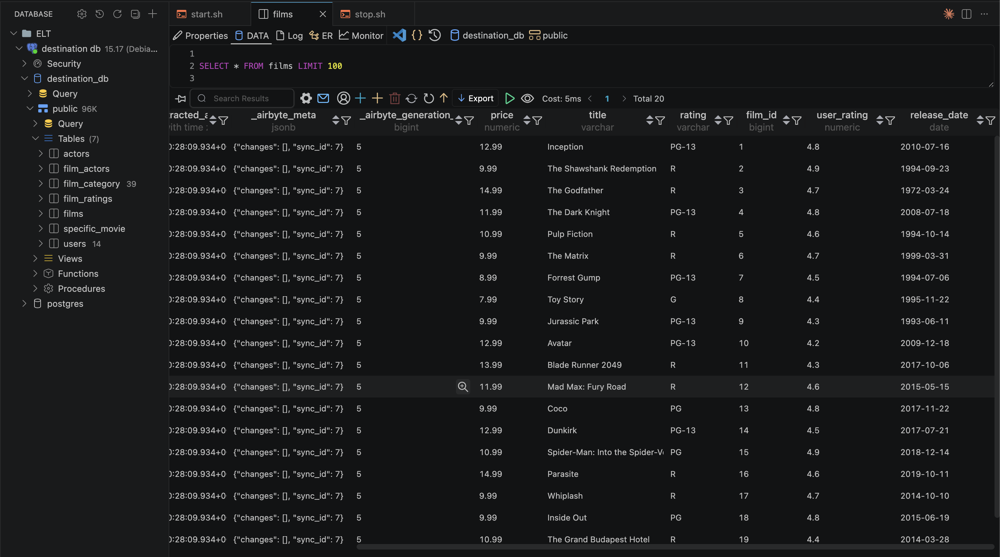
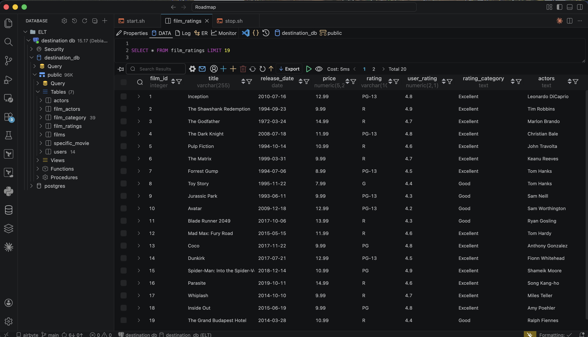

# Pipeline ELT — Airflow + Airbyte + dbt

Pipeline ELT (Extract-Load-Transform) auto-hébergé qui orchestre une ingestion Airbyte (Postgres → Postgres) suivie de transformations dbt, le tout piloté par Airflow 3.

## Ce que fait le projet

```text
┌─────────────┐    Airbyte sync    ┌──────────────────┐    dbt run     ┌──────────────────┐
│ source_db   │  ───────────────►  │  destination_db  │  ───────────►  │  modèles dbt     │
│ (Postgres)  │   (DAG Airflow)    │   (Postgres)     │  (transform)   │  (tables finales)│
└─────────────┘                    └──────────────────┘                └──────────────────┘
```

Un DAG Airflow (`elt_and_dbt`) enchaîne deux tâches :

1. **`airbyte_postgres_postgres`** — déclenche une sync Airbyte qui copie les données de la DB source vers la DB destination.
2. **`dbt_run`** — lance un container dbt-postgres qui exécute les modèles SQL pour transformer les données copiées.

## Stack technique

| Composant | Version | Rôle |
| --------- | ------- | ---- |
| Apache Airflow | 3.2.1 | Orchestration (scheduler + api-server + dag-processor) |
| Airbyte (via `abctl`) | v0.30.4 | Ingestion source → destination |
| dbt-postgres | 1.9.0 | Transformations SQL |
| PostgreSQL | 15 | DB source, DB destination, metadata Airflow |
| `apache-airflow-providers-airbyte` | 5.4.1 | Pont Airflow → Airbyte |
| `apache-airflow-providers-docker` | 4.5.5 | Lance dbt en container sibling |
| `airbyte-api` (SDK Python) | 0.53.0 | Client OAuth2 du provider Airbyte |

Toutes les versions sont **figées** dans le `Dockerfile` et `docker-compose.yml` pour garantir la reproductibilité.

## Structure du projet

```text
.
├── airflow/
│   ├── Dockerfile          # Image Airflow custom (providers + patches SDK Airbyte)
│   ├── airflow.cfg
│   └── dags/
│       └── elt_dag.py      # Le DAG ELT
│
├── dbt_transformations/    # Projet dbt (modèles SQL, tests, snapshots)
│   ├── dbt_project.yml
│   └── models/example/
│
├── elt/
│   ├── elt_script.py       # Première version Python (vestige pédagogique, non utilisé)
│   └── Dockerfile
│
├── source_db_init/
│   └── init.sql            # Données de seed pour source_postgres
│
├── docker-compose.yml      # Orchestration locale de toute la stack Airflow
├── start.sh                # Up Airflow + Airbyte + port-forward
├── stop.sh                 # Down propre
│
├── .env.example            # Template à copier en .env
├── README.md
└── TROUBLESHOOTING.md      # Tous les bugs rencontrés et leurs fixes
```

## Prérequis

- **Docker Desktop** (testé avec Docker 27+)
- **abctl** v0.30.4 ([install](https://docs.airbyte.com/platform/deploying-airbyte/abctl))
- **kubectl** v1.34+ (livré avec Docker Desktop ou Homebrew)
- macOS / Linux (le projet utilise `host.docker.internal` qui marche partout)

## Démarrage rapide

### 1. Cloner et configurer

```bash
git clone <ce-repo>
cd ELT
cp .env.example .env
```

### 2. Générer une clé Fernet pour Airflow

Airflow chiffre les credentials (connexions, variables) avec une clé Fernet. Il faut **en générer une** et la mettre dans `.env` :

```bash
python -c "from cryptography.fernet import Fernet; print(Fernet.generate_key().decode())"
```

Copier le résultat dans la variable `AIRFLOW_FERNET_KEY` du fichier `.env`.

> Pour `AIRFLOW_API_SECRET_KEY` et `AIRFLOW_JWT_SECRET`, n'importe quelle string aléatoire fait l'affaire en local. En prod, utilise `openssl rand -hex 32`.

### 3. Lancer la stack

```bash
./start.sh
```

Ça enchaîne :

- `docker compose up` — Airflow + 2 Postgres source/destination + Postgres metadata
- `abctl local install` — déploie Airbyte dans un cluster Kubernetes kind local
- `kubectl port-forward` — expose l'API Airbyte sur le port 8001

### 4. Configurer Airbyte (UI : <http://localhost:8000>)

Login avec :

```bash
abctl local credentials
```

Dans l'UI, créer :

1. Une **source** Postgres (host : `source_postgres`, port `5433`, db `source_db`, user `postgres`, password `secret`)
2. Une **destination** Postgres (host : `destination_postgres`, port `5434`, db `destination_db`, user : `postgres`, password : `secret`)
3. Une **connection** entre les deux → noter le `connectionId` qui apparaît dans l'URL.

Mettre cet ID dans `airflow/dags/elt_dag.py` :

```python
CONN_ID = '<le-connection-id>'
```

> Attention : chaque `abctl local uninstall` efface tout, il faut tout recréer (cf. [TROUBLESHOOTING.md §4](TROUBLESHOOTING.md)).

### 5. Configurer la connexion Airflow → Airbyte (UI : <http://localhost:8080>)

Login `airflow` / `password`, puis `Admin > Connections > +` :

| Champ | Valeur |
| ----- | ------ |
| Connection Id | `airbyte` |
| Connection Type | `Airbyte` |
| Host | `http://host.docker.internal:8000/api/public/v1` |
| Schema | `http://host.docker.internal:8001/api/v1/applications/token` |
| Login | `<Client-Id>` (depuis `abctl local credentials`) |
| Password | `<Client-Secret>` (idem) |

### 6. Trigger le DAG

Dans l'UI Airflow, activer `elt_and_dbt` puis cliquer sur "Trigger DAG". Les deux tâches doivent passer en `success`.

### 7. Arrêter

```bash
./stop.sh
```

## Quelque chose ne marche pas ?

Voir [TROUBLESHOOTING.md](TROUBLESHOOTING.md) — tous les bugs rencontrés pendant le développement y sont documentés avec leur cause et leur fix. Les problèmes les plus courants :

- **`JSONDecodeError` au démarrage de la tâche Airbyte** → patches SDK manquants (cf. §2 bugs A/B/C).
- **`403 Forbidden` sur l'API Airbyte** → mauvais endpoint dans la connexion Airflow (cf. §3).
- **`Database Error: relation already exists`** → la destination contient des artefacts d'une ancienne sync, faire un reset.

## Screenshots

DAG en succès — les deux tâches `airbyte_postgres_postgres → dbt_run` en vert :


Connexion Airbyte (source → destination) :



Tables transformées par dbt dans `destination_db` :





## Origine du projet

Projet d'apprentissage construit à partir du tuto [`justinbchau/custom-elt-project`](https://github.com/justinbchau/custom-elt-project) (5 branches : `airbyte`, `airflow`, `cron`, `dbt`, `main`), consolidé en un pipeline unique avec :

- Airflow 3 multi-container (au lieu d'Airflow 2 monolithique)
- Airbyte via `abctl` / Kubernetes (au lieu de Docker Compose Airbyte)
- Patches custom du SDK Airbyte pour contourner des incompatibilités OAuth2
- Versions figées et configuration externalisée pour la reproductibilité
